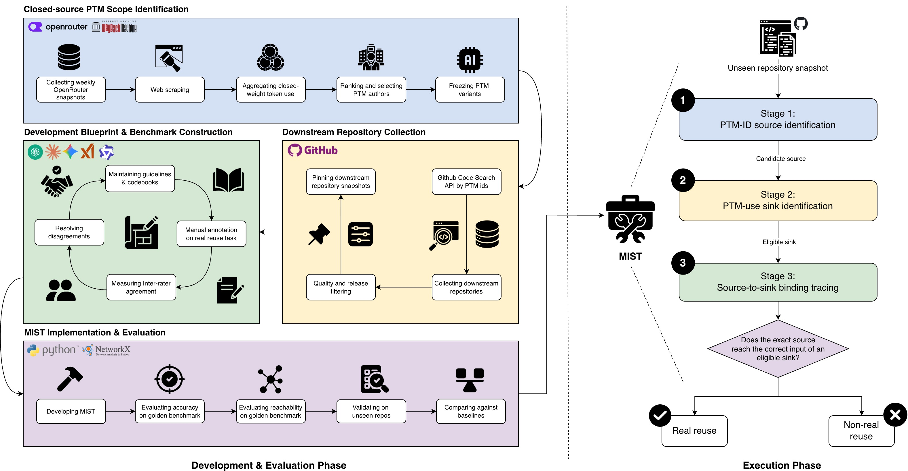

# Replication Package

## 🌫️🔍 Seeing Through the MIST: Tracing Closed-Source Pre-trained AI Model Dependencies Across Files and Releases

This repository contains MIST (*Model Identifier-to-Sink Tracing*), collection and analysis scripts, datasets, reviewed annotations, and results for our study of closed-source pre-trained model (PTM) dependencies.

Maintaining software that relies on PTMs requires knowing which PTMs it uses and where changes may require code updates. A PTM ID can appear without real reuse, and its count can stay unchanged while integration code changes. MIST traces an exact PTM ID occurrence to an eligible PTM-use call and retains the connecting code as a *PTM binding*. We use these bindings to validate reuse and study integration and evolution across releases.

> [!TIP]
> To inspect the results, start with [RQ1 evaluation](analysis/rq1/evaluation/README.md), [RQ2a](analysis/rq2a/README.md), or [RQ2b](analysis/rq2b/README.md). To analyze your own repository, start with [MIST](mist/README.md).

## Research questions

- **RQ1 — Reuse detection:** How accurately can MIST identify closed-source PTM reuse?
- **RQ2a — PTM integration:** How is closed-source PTM reuse implemented, and how often does it span files or procedures?
- **RQ2b — PTM evolution:** What do PTM bindings identified by MIST reveal about the evolution of closed-source PTM dependencies?

The diagram shows data collection, annotation, and MIST evaluation on the left, and MIST's reuse-validation steps on the right.



## 🗂️ Package contents

| Folder | Contents |
| --- | --- |
| [collection/](collection/README.md) | PTM catalogue selection, GitHub collection, and saved inputs |
| [mist/](mist/README.md) | The tool, 427 PTM IDs, and detection rules |
| [analysis/rq1/](analysis/rq1/evaluation/README.md) | Annotation codebooks, classification, reachability, and baseline evaluation |
| [analysis/rq2a/](analysis/rq2a/README.md) | Access interfaces, interface mixing, and binding locality |
| [analysis/rq2b/](analysis/rq2b/README.md) | PTM change detection, count visibility, integration annotations, and change breadth |
| [database/](database/README.md) | SQLite schema and access to saved code evidence |

## ⚙️ Reproducing the study

Use Python 3.10.12. Each folder lists its dependencies and commands. Keep MIST and the baselines in separate environments, following their READMEs.

For a quick start, score the supplied RQ1 predictions and reachability results from the repository root:

```bash
python -m venv .venv
source .venv/bin/activate
python -m pip install -r analysis/rq1/evaluation/requirements.txt
python analysis/rq1/evaluation/classification/evaluate.py
python analysis/rq1/evaluation/reachability/evaluate.py
```

These commands use the included data without running the tools or accessing GitHub. The classification workbooks contain 328 benchmark cases and 485 unseen holdout cases; reachability covers the 93 benchmark reuse cases.

To reproduce the remaining steps:

1. **Collection:** replay the saved catalogue and repository inputs, or run new online collection using the [collection guide](collection/README.md).
2. **Reuse validation:** run [MIST](mist/README.md) on fixed repository checkouts. The [RQ1 guide](analysis/rq1/evaluation/README.md) explains how to rerun the evaluated methods and score their outputs.
3. **Integration and evolution:** download the database archive, then follow [RQ2a](analysis/rq2a/README.md) and [RQ2b](analysis/rq2b/README.md). These scripts analyze saved bindings and reviewed annotations rather than rerunning MIST or manual coding.

## 🗄️ Database and evidence

**Dataset and validation evidence:** [Figshare (private review link)](https://figshare.com/s/7cc2423e7aae7520888d).

The archive contains one SQLite database in `ptm_database/`, a summary, and available source, graph, and validation evidence. It retains the 1,219-repository population, confirmed snapshot bindings from 450 repositories for RQ2a, and the 411 repository histories analyzed in RQ2b. Keep the database and its evidence folders together as described in the [database guide](database/README.md).

It also includes `rq1_validation_evidence/`, with nine MIST output files per repository for the 86 benchmark and 100 unseen holdout repositories. The [RQ1 guide](analysis/rq1/evaluation/README.md#recalculate-reachability) explains how to recalculate reachability from the graphs in its `benchmark/` folder.

> [!IMPORTANT]
> RQ2a and RQ2b use the same database. The scripts select snapshot bindings or release histories as needed. Keep all 5,858 release pairs for RQ2b. RQ1 scoring and offline collection replay do not need the database.

## Notes on reproducibility

> [!WARNING]
> GitHub search, repository availability, metadata, and Wayback Machine captures can change. New collection may not reproduce the saved data exactly. Use the supplied inputs and fixed commits when reproducing the reported results.

Keep MIST's pinned library versions, as import resolution can depend on the installed environment. An unresolved trace does not prove non-reuse, and a static binding does not prove runtime execution.

## Citation

Paper citation details will be added when available. Please cite the paper and the Figshare dataset when using this package.
